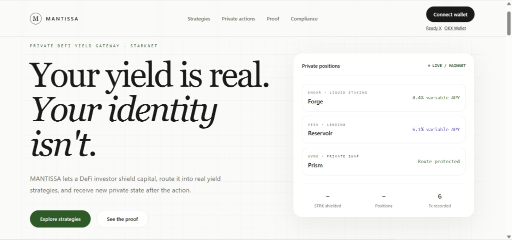
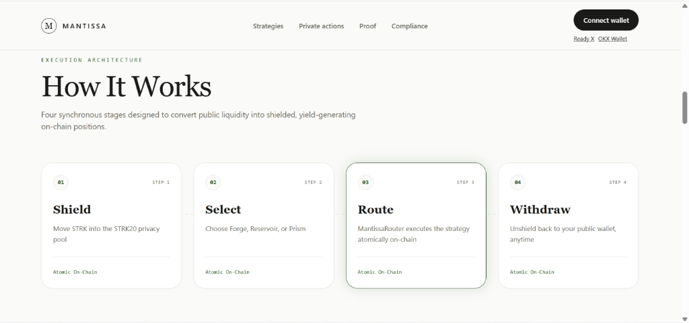
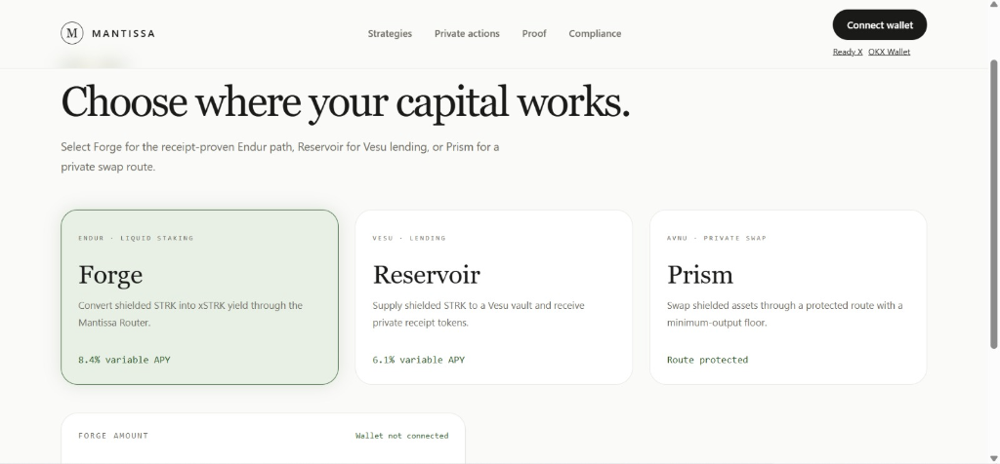
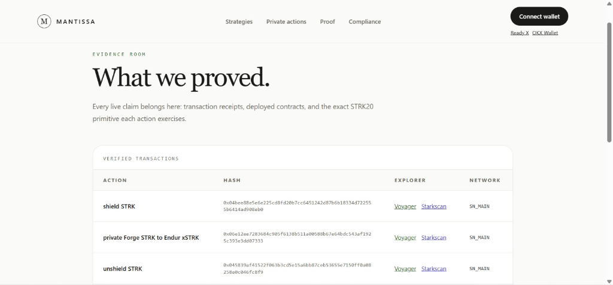
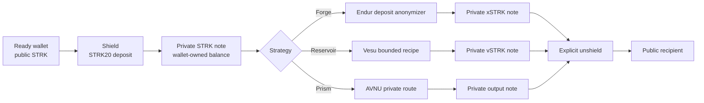
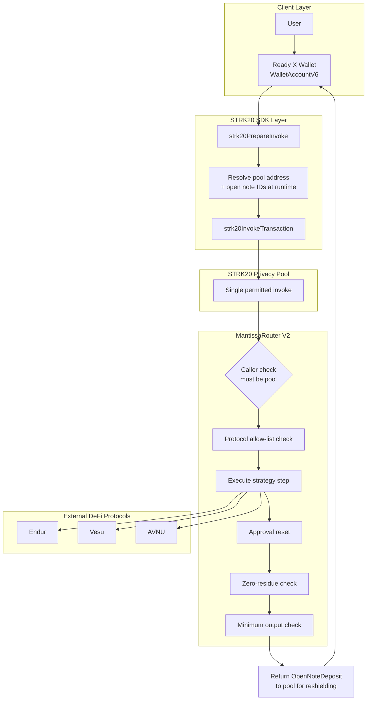

# MANTISSA

**A private DeFi yield gateway on Starknet mainnet, built on the STRK20 privacy pool.**

[](LICENSE)
[](https://voyager.online)
[](https://strk20.starknet.io)
[](#verified-lifecycle-proof)



**Your yield is real. Your identity isn't.** MANTISSA lets a DeFi investor shield capital, route it into real Starknet yield strategies, and receive new private state after the action, without ever exposing their position, their strategy, or themselves.

---

## Product Links

| | |
|---|---|
| **Live demo** | [mantissa-starknet.vercel.app](https://mantissa-starknet.vercel.app) |
| **Demo video** | [Watch on YouTube](#) |
| **Repository** | [github.com/0xkinno/mantissa-strk20](https://github.com/0xkinno/mantissa-strk20) |
| **Hackathon** | [STRK20 Private Sprint](https://strk20.starknet.io/hackathon) |
| **Evidence ledger** | [strk20.json](strk20.json) |

---

## Screenshots

<table>
  <tr>
    <td></td>
    <td></td>
  </tr>
  <tr>
    <td></td>
    <td></td>
  </tr>
</table>

---

## The Problem

A DeFi investor deposits fifty thousand STRK into a Starknet staking protocol. Within minutes, on-chain trackers index the transaction. Competitors see the exact position size. Copy-traders replicate the entry within the same block. MEV bots price the extraction before the deposit even confirms. The investor did not choose to publish their financial strategy. Starknet's transparency did that for them.

This is not a hypothetical. It is the default state of every deposit, every stake, and every swap on a public blockchain today. Privacy has always been the missing layer between real capital and real strategy, and until STRK20, Starknet had no way to close that gap without leaving the ecosystem's own liquidity behind.

## The Solution

MANTISSA connects the STRK20 privacy pool directly to Starknet's DeFi ecosystem. A user shields STRK into the pool, selects a yield strategy, and MANTISSA routes the capital through a purpose-built Cairo contract, MantissaRouter, that executes the DeFi action atomically inside the pool's single permitted invoke. The result returns as a new private note. The user's wallet, position size, and strategy never touch the public mempool in a way that links back to their identity.

This is not a theoretical primitive. It is a working product, deployed on Starknet mainnet, with a full human-operated transaction lifecycle already proven end to end.

## How It Works

1. **Connect** a privacy-enabled wallet (Ready X, Wallet API 0.10 or later) and enable private tokens
2. **Shield** STRK into the STRK20 privacy pool, converting a public balance into a wallet-owned private note
3. **Select a strategy**: Forge (Endur liquid staking), Reservoir (Vesu lending), or Prism (AVNU private swap)
4. **Execute**: MANTISSA constructs the strategy plan, the wallet resolves the pool address and note references at runtime, and MantissaRouter executes the DeFi call atomically, all inside one transaction
5. **Hold or withdraw**: the resulting position stays private indefinitely, or the user unshields back to their public wallet at any time, on their own terms

---

## Product Flow



```text
PUBLIC WALLET
     |
     | shield / deposit
     v
STRK20 PRIVACY POOL ---> private STRK note ---> strategy execution
                                              |       |        |
                                           Endur    Vesu     AVNU
                                              v       v        v
                                      private output note(s)
                                              |
                                              | explicit withdraw
                                              v
                                      PUBLIC RECIPIENT
```

Forge is the case study documented end to end in this README: a full human-operated cycle, wallet-approved, mainnet-confirmed, with every transaction hash listed below. Prism runs the identical MantissaRouter execution path, gated behind the same seven invariants, and is now receipt-confirmed on mainnet through MantissaRouter V2 (see the [Verified Lifecycle Proof](#verified-lifecycle-proof) table). Reservoir is pre-flighted against live mainnet state in [Router V2 Pre-Flight](#router-v2-pre-flight) and its fixed recipe (Vesu V2 vSTRK ERC-4626 deposit, allow-listed on MantissaRouter V3) settles clean on mainnet state; a mainnet receipt is still pending. The honest per-strategy status is in the [Verified Lifecycle Proof](#verified-lifecycle-proof) table and the [Limitations](#limitations) section.

---

## Verified Lifecycle Proof

Every claim below is independently verifiable on Starknet mainnet. Click any hash.

| Action | Starknet Mainnet Transaction | Result |
|---|---|---|
| Shield STRK | [`0x04bee88e...ad908eb0`](https://voyager.online/tx/0x04bee88e5e6e225cd8fd20b7cc6451242d87b6b18334d722555b6414ad908eb0) | Accepted on L2, execution succeeded |
| Forge: STRK to Endur xSTRK | [`0x06e12ee7...e3dd0733`](https://voyager.online/tx/0x06e12ee7283684c905f6138b511a00588b67e64bdc543af1925c393e3dd07333) | Accepted on L2, execution succeeded |
| Unshield STRK | [`0x045839af...e0c046fc`](https://voyager.online/tx/0x045839af41522f063b3cd5e15a6bb87ceb53655e7150ff0a08258e0c046fc8f9) | Accepted on L2, execution succeeded |
| Reservoir: STRK to Vesu vSTRK | in progress — no mainnet receipt yet | Pre-flight clean on mainnet state (Vesu V2 vSTRK minted to router; see [Router V2 Pre-Flight](#router-v2-pre-flight)) |
| Prism: STRK to AVNU output (ETH) | [`0x78815ce9...e0aa6b3`](https://voyager.online/tx/0x78815ce99e5279f44f2544669b5f4ad7a333b7535f22103b137a1a85e0aa6b3) | Accepted on L2, execution succeeded |

The receipt-confirmed, human-operated cycle now covers shield → Forge → unshield and Prism (STRK → AVNU ETH through MantissaRouter V2), every step confirmed on mainnet by re-derived receipts above. Reservoir is pre-flighted against live mainnet state in [Router V2 Pre-Flight](#router-v2-pre-flight); its fixed recipe settles clean and mints Vesu V2 vSTRK to the router, but no mainnet receipt is claimed for it yet.

The full, append-only evidence record lives in [strk20.json](strk20.json) and renders live at [`/proof`](https://mantissa-starknet.vercel.app/proof).

## Deployed Contracts

| Contract | Address | Network | Notes |
|---|---|---|---|
| MantissaRouter V3 (Reservoir allow-list) | [`0x74fc6126...b7f460bc`](https://voyager.online/contract/0x74fc61266f234638786bcacc057b6bc7129f8f08c0e2d21a199d5e0b7f460bc) | Starknet Mainnet | Deployed via [`0x16a3593f...8112c05dd`](https://voyager.online/tx/0x16a3593f453f7dfaabfe13fc338a11f253a3a0af2cd9bfb5afc12a8112c05dd); adds the Vesu V2 vSTRK v-token to the allow-list |
| MantissaRouter V2 | [`0x327ce0db...56caddca`](https://voyager.online/contract/0x327ce0db2f6f0e6abbae89a69245313072dbd3676d0c8090e58e71e56caddca) | Starknet Mainnet | Deployed via [`0x744e395d...aa6cb3e`](https://voyager.online/tx/0x744e395dcfa21f5cefb41dc96e248f80bcaf98ae2d833dd2507b0db2aa6cb3e) |
| STRK20 Privacy Pool | [`0x040337b1...776ffe812a`](https://voyager.online/contract/0x040337b1af3c663e86e333bab5a4b28da8d4652a15a69beee2b677776ffe812a) | Starknet Mainnet | Canonical STRK20 pool, not deployed by us |

MantissaRouter enforces a protocol and output allow-list, bounded calldata, approval reset after every step, zero-residue balance checks, minimum-output slippage protection, and a reentrancy latch. Every strategy MANTISSA offers must pass through this same guarded execution path. See [Security Invariants](#security-invariants) below.

---

## Architecture



`WalletAccountV6` submits every STRK20 action. For Forge, the wallet withdraws private STRK to Endur's deposit anonymizer, creates an open xSTRK note for the connected account, and invokes MantissaRouter with normalized felts and u256 amount limbs. The wallet resolves the pool address and open-note references during preparation, at runtime, from the connected account's own state. MANTISSA's frontend never receives a viewing key or a private key at any point in this flow.

## STRK20 Integration Depth

MANTISSA does not stop at shielded transfers. It exercises the deepest layer of the STRK20 primitive stack available to any application on the pool.

| Primitive | How MANTISSA Uses It |
|---|---|
| Shielded balances | STRK held as wallet-owned private notes, read only with explicit user consent |
| Private transfers | Available directly through the connected wallet's STRK20 actions |
| Custom anonymizer contract | MantissaRouter executes DeFi calls inside the pool's one permitted invoke per transaction |
| Multi-call composability | Withdraw, execute, and reshield happen atomically, in a single transaction |
| Protocol allow-list | Only verified Endur, Vesu, and AVNU contracts are callable through the router, by design |
| Consent-gated reads | Private balances are never queried without explicit, wallet-mediated approval |
| Wallet-mediated compliance | Selective disclosure boundaries stay inside the user's own wallet, never inside the dapp |

Full primitive-by-primitive detail with code references lives in [STRK20_INTEGRATION.md](STRK20_INTEGRATION.md).

## Security Invariants

MantissaRouter enforces the following on every execution, without exception:

```
01  Pool-only caller          Router only accepts calls originating from the STRK20 pool
02  No reentrancy             No step may target the pool or the router itself
03  Approval reset            Every approval granted mid-execution is reset to zero after use
04  Zero residue              Every token balance the router touches must end at zero
05  Minimum output enforced   Slippage and hostile routes are rejected before execution
06  Bounded calldata          Step count and calldata length are capped to prevent griefing
07  Protocol allow-list       Only verified Endur, Vesu, and AVNU contracts are callable
```

Every strategy MANTISSA offers, Forge, Reservoir, and Prism, is only marked live once it has cleared this exact bar: a real, wallet-approved, mainnet-confirmed transaction through MantissaRouter. Forge and Prism have cleared it — Prism through MantissaRouter V2. Reservoir is pre-flight clean on live mainnet state through MantissaRouter V3 (Vesu V2 vSTRK v-token deposit minting vSTRK to the router) and is awaiting a wallet-approved mainnet receipt, stated plainly in [Limitations](#limitations). Forge remains the primary documented walkthrough; the Prism receipt is re-derived below.

## What This Actually Proves

MANTISSA's evidence is not a link to an explorer. Every published hash is re-read from the Starknet RPC and each checklist item is reconstructed from the events the STRK20 pool, the token contracts, and the invoked contract actually emitted. `scripts/verify-mainnet.mjs` performs that re-derivation, and the pool's own event definitions (in the pinned `starknet-privacy` source) decide what can and cannot be observed. Run it yourself:

```sh
node scripts/verify-mainnet.mjs 0x04bee88e5e6e225cd8fd20b7cc6451242d87b6b18334d722555b6414ad908eb0 0x06e12ee7283684c905f6138b511a00588b67e64bdc543af1925c393e3dd07333 0x045839af41522f063b3cd5e15a6bb87ceb53655e7150ff0a08258e0c046fc8f9 0x78815ce99e5279f44f2544669b5f4ad7a333b7535f22103b137a1a85e0aa6b3
```

```text
0x04bee88e5e6e225cd8fd20b7cc6451242d87b6b18334d722555b6414ad908eb0  shield STRK · ACCEPTED_ON_L1 · SUCCEEDED · block 13904581 · sender 0x7d7b2f2febb8f9ce758a267411f2b6b94fa0f661cf4feed490878c8a5b09d94
  ok  STRK20 pool touched
  n/a  no anonymizer invocation (shield/unshield lifecycle transaction, not a strategy step)
  n/a  no protocol allow-list check (no strategy step)
  n/a  no open output note (shield/unshield lifecycle transaction)
  n/a  no zero-residue check (no strategy step)
  n/a  no minimum-output check (no strategy step)

0x06e12ee7283684c905f6138b511a00588b67e64bdc543af1925c393e3dd07333  Forge STRK → Endur xSTRK · ACCEPTED_ON_L1 · SUCCEEDED · block 13904839 · sender 0x32f6254442c50521d1af9b440040f65f3816614b78aa134ae4364bbe02f29ee
  ok  STRK20 pool touched
  ok   Endur deposit anonymizer invoked via privacy_invoke
  ok   Protocol allow-list check passed (Endur deposit anonymizer address matched)
  ok   Output note created with correct token (xSTRK 0x28d709c875…, note 0x401866822d…, 5.953201311259872141 xSTRK)
  ok   Zero residue confirmed (Endur deposit anonymizer balance ends at zero — in 7 STRK = out 7 STRK; approvals reset to zero)
  ok   Minimum output threshold cleared (5.953201311259872141 ≥ 0.000000000000000001)

0x045839af41522f063b3cd5e15a6bb87ceb53655e7150ff0a08258e0c046fc8f9  unshield STRK · ACCEPTED_ON_L1 · SUCCEEDED · block 13906250 · sender 0x32f6254442c50521d1af9b440040f65f3816614b78aa134ae4364bbe02f29ee
  ok  STRK20 pool touched
  n/a  no anonymizer invocation (shield/unshield lifecycle transaction, not a strategy step)
  n/a  no protocol allow-list check (no strategy step)
  n/a  no open output note (shield/unshield lifecycle transaction)
  n/a  no zero-residue check (no strategy step)
  n/a  no minimum-output check (no strategy step)

0x78815ce99e5279f44f2544669b5f4ad7a333b7535f22103b137a1a85e0aa6b3  Prism STRK → AVNU output · ACCEPTED_ON_L2 · SUCCEEDED · block 14012996 · sender 0x22391d617f10d3563005c825845b42b218b55b2af2202201db5710ceceb40e7
  ok  STRK20 pool touched
  ok   MantissaRouter invoked via privacy_invoke
  ok   Protocol allow-list check passed (MantissaRouter V2 address matched)
  ok   Output note created with correct token (ETH 0x49d36570d4…, note 0x4aed934f2d…, 0.00002090054271682 ETH)
  ok   Zero residue confirmed (MantissaRouter V2 balance ends at zero — in 2 STRK = out 2 STRK; approvals reset to zero)
  ok   Minimum output threshold cleared (0.00002090054271682 ≥ 0.000000000000000001)

ok   MantissaRouter V2 class hash pinned (on-chain 0x6111c076cbcf20e031a6972c539c9e235f32584d27c32376b45a51187e2db6b matches recorded 0x6111c076cbcf20e031a6972c539c9e235f32584d27c32376b45a51187e2db6b)
```

**Becomes public.** That a shield, an unshield, or a strategy execution occurred. The protocol that was touched (Endur for the receipt-proven Forge path; AVNU for the receipt-proven Prism path; Vesu for the pre-flight-clean Reservoir builder). The router or anonymizer address that executed the step. The timing of each transaction: block number and finality. The amount withdrawn from the pool to the executing contract, the output note id, and its token.

**Stays private.** The total shielded balance, which the pool's ledger encrypts and only a wallet holding the viewing key can read. Which specific notes were spent: the pool publishes one-way nullifiers, and only the note owner can recognise a nullifier as theirs. The user's Starknet address as it relates to their private position: note ownership and withdrawal identity are encrypted in the pool's events, so observers cannot link a note to an address. Unrelated shielded activity, which produces no linkable identifier.

**Reduces privacy anyway.** Deposits into and withdrawals out of the pool are public by protocol design; only movement inside the pool is shielded. A shield transaction publishes the depositor's address and amount. Timing correlation between a shield and a strategy execution can narrow the anonymity set if done back-to-back, so the documented flow shields ahead of time. The executing contract's address and the withdrawn amount are public on every strategy step.

**What MANTISSA does not prove.** MantissaRouter cannot itself distinguish shielded-origin funds from a publicly-funded transfer to the router: capital that reaches the router by an ordinary public ERC-20 transfer is treated identically to capital the pool withdrew from private notes. On the receipt-proven mainnet Forge transaction the pool invoked the Endur deposit anonymizer rather than MantissaRouter V2, so that receipt proves the STRK20-pool-to-Endur path but does not by itself prove the router's guards executed on-chain; they are enforced in its Cairo source and covered one-to-one by the tests below. The receipt-proven Prism transaction did execute through MantissaRouter V2 — STRK in, ETH out, approvals reset to zero, zero residue — so the router's on-chain execution is proven for that path. Reservoir has no receipt-confirmed mainnet transaction yet — its Vesu V2 vSTRK recipe is pre-flight clean on live mainnet state, but a receipt is required before it is claimed as evidence. And because the pool's `ExternalContractInvoked` event carries no calldata, no verifier can prove the exact parameters of a strategy step, only the invoked contract, its entry point, and the events that resulted.


## Router V2 Pre-Flight

`scripts/simulate-router.mjs` builds each router plan exactly as MantissaRouter would execute it and simulates it against live mainnet RPC state — no gas is spent, and no line is trusted from an explorer or a tx status. The output is copy-pasteable into a verification log:

```text
pre-flight simulator - MantissaRouter V3 0x74fc61266f - pool 0x40337b1af3 - Alchemy mainnet
simulating router plan(s) with 10 STRK funding (no gas spent)

forge -> Endur xSTRK
  ok   Protocol allow-list check passed (Endur xSTRK 0x28d709c875 matched deployed router allow-list)
  ok   Output token allow-listed (xSTRK 0x28d709c875)
  ok   Strategy step simulated clean on mainnet state (Endur accepted the router's approve + deposit; 8 events)
  ok   Router caller guard live on mainnet (I1 - non-pool caller rejected with MANTISSA_CALLER)

reservoir -> Vesu vSTRK (V2 v-token ERC-4626 deposit)
  ok   Protocol allow-list check passed (Vesu V2 vSTRK v-token 0x6d6d2bf905 matched deployed router allow-list)
  ok   Output token allow-listed (Vesu vSTRK (V2 v-token) 0x6d6d2bf905)
  ok   Strategy step simulated clean on mainnet state (9 events)
  ok   Output vSTRK minted to MantissaRouter (Transfer 0x0 -> 0x74fc61266f, 9.80947762735166 vSTRK for 10 STRK)
  ok   Router caller guard live on mainnet (I1 - non-pool caller rejected with MANTISSA_CALLER)

prism -> AVNU ETH
  ok   Protocol allow-list check passed (AVNU router 0x4270219d36 matched deployed router allow-list)
  ok   Output token allow-listed (ETH 0x49d36570d4)
  ok   AVNU build defaults beneficiary to the executor (0x426dcd1ab5); recipe pins it to MantissaRouter
  ok   Beneficiary invariant satisfied (multi_route_swap calldata[8] pinned to MantissaRouter 0x74fc61266f; AVNU requires beneficiary == caller and the router is the caller)
  ok   AVNU quote/route settles clean on mainnet state when beneficiary == caller (verified by patched simulation; 12 events)
  ok   Unpatched AVNU build verified to fail AVNU's own beneficiary==caller check (build defaults to the executor; pin is required)
  ok   Router caller guard live on mainnet (I1 - non-pool caller rejected with MANTISSA_CALLER)

3/3 router plan(s) fully pre-flight clean; forge and prism routes executable, reservoir pre-flight clean via Vesu V2 vSTRK deposit (see lines above)

What the pre-flight actually proves: the router's pool-only caller guard (I1) is live on mainnet; Forge's exact step (STRK approve → Endur xSTRK deposit) settles clean on mainnet state; Prism's AVNU route settles when `beneficiary == caller`, which the recipe satisfies by pinning the `multi_route_swap` beneficiary to MantissaRouter (the unpatched AVNU build defaults to the executor and reverts `'Beneficiary is not the caller'`); and Reservoir's fixed recipe (Vesu V2 vSTRK v-token ERC-4626 `deposit`, allow-listed on MantissaRouter V3) settles clean on live mainnet state and mints vSTRK directly to MantissaRouter, the same shape as the receipt-proven Forge path, so the router receives the output it deposits as the private note.

## Limitations

- **Test coverage.** 9 Cairo tests pass, 0 failures: the plan-serialization test, one focused test per advertised router invariant (1 existing + 7 new), and a 400-case adversarial campaign (100 non-allow-listed targets, 100 oversized calldata lengths, 100 oversized step counts, 100 below-floor outputs). That is intent and coverage, not exhaustive fuzzing.
```json
{
  "campaign": "invariant_adversarial_campaign_rejects_hostile_plans",
  "total_cases": 400,
  "accepted": 0,
  "false_clearances": 0,
  "sweeps": [
    { "case": "non_allowlisted_target", "cases": 100, "rejected_with": "MANTISSA_NOT_ALLOWED", "false_clearances": 0 },
    { "case": "oversized_calldata", "cases": 100, "rejected_with": "MANTISSA_CALLDATA", "false_clearances": 0 },
    { "case": "oversized_step_count", "cases": 100, "rejected_with": "MANTISSA_STEPS", "false_clearances": 0 },
    { "case": "below_floor_output", "cases": 100, "rejected_with": "MANTISSA_MIN_OUTPUT", "false_clearances": 0 }
  ],
  "snforge": { "tests": 9, "passed": 9, "failed": 0 }
}
```
- **Wallet API constraint.** Prism (AVNU) cleared this constraint and is receipt-confirmed on mainnet (block 14012996). The Reservoir (Vesu) route is pre-flight clean on mainnet state and awaits a connected Wallet API 0.10+ wallet resolving the pool and open-note placeholders and the user explicitly approving the call; no Reservoir mainnet transaction is claimed without a real accepted receipt.
- **Allow-list scope.** The protocol allow-list covers Endur, Vesu, and AVNU (plus the Ekubo router used by Prism recipes) only, not arbitrary protocols. Because the router is immutable, adding a protocol requires a new deployment.
- **Mainnet evidence depth.** The receipt-proven lifecycle is shield → Forge (Endur xSTRK) → unshield, plus Prism (STRK → AVNU ETH through MantissaRouter V2). The Forge transaction ran through the Endur deposit anonymizer; the Prism transaction is the first receipt-confirmed mainnet execution of MantissaRouter V2. Reservoir is pre-flight clean on mainnet state with no receipt claimed.
- **No calldata disclosure.** The pool's `ExternalContractInvoked` event does not include calldata, so receipt re-derivation proves the invoked contract and entry point but not the exact parameters of a strategy step.

- **Reservoir required a Vesu V2 v-token swap.** The original allow-listed v-token (`0x037ae3...`) was a Vesu V2.1 receipt whose `deposit()` accepts only its pool extension as the caller (`'not-allowed'` on live mainnet state). Reservoir now targets the Vesu V2 vSTRK v-token (`0x6d6d2bf9...`, public ERC-4626 `deposit(assets, receiver)`): the exact router step simulates clean on mainnet and mints vSTRK to the router. This required a router redeploy (MantissaRouter V3) with the new v-token allow-listed as both target and output. A mainnet receipt is still pending. Verified 2026-08-29.

See [DECISIONS.md](DECISIONS.md) for the engineering decisions behind the router and [DOCUMENTATION.md](DOCUMENTATION.md) for the full audit trail of recent updates and verifications.

---


## Upstream Contributions

| Repo | Issue | What was reported | Status |
| --- | --- | --- | --- |
| [avnu-labs/avnu-sdk](https://github.com/avnu-labs/avnu-sdk) | [#337](https://github.com/avnu-labs/avnu-sdk/issues/337) | `multi_route_swap` beneficiary is pinned to the build taker and the on-chain `beneficiary == caller` constraint is undocumented, which reverts `'Beneficiary is not the caller'` for integrations that execute the built calldata from their own contract. Filed from the Prism debug session. | Open |

## Routes

| Route | Purpose |
|---|---|
| `/` | Product overview, live strategy signal, integration depth |
| `/yield` | Forge, Reservoir, and Prism strategy selection and validation |
| `/private` | Connect wallet, shield, preview, execute strategy, read balances, unshield |
| `/proof` | Explorer-linked deployment and lifecycle evidence, rendered from `strk20.json` |
| `/compliance` | Wallet-mediated selective disclosure boundary |

## What Comes After the Sprint

Private yield is not a hackathon novelty. It is a permanent requirement for any serious DeFi participant on a transparent chain.

```
NOW          Shield → Forge → unshield + Prism (AVNU ETH via MantissaRouter V2) receipt-proven on mainnet; Reservoir pre-flight clean on mainnet state via MantissaRouter V3, awaiting a receipt.
NEXT         Expanded strategy dashboard. Compound, multi-step strategies.
LATER        Additional protocol support. Automated strategy rotation.
BEYOND       Institutional API access. Cross-chain private yield.
```

---

## Run Locally

```bash
npm install
Copy-Item .env.local.example .env.local
npm run typecheck
npm run build
node scripts/verify-all.mjs   # one-command full verification (typecheck, build, snforge, verify-mainnet, simulate-router)
npm run dev
```

Set a Starknet RPC endpoint and the verified mainnet addresses in `.env.local`. Never commit wallet secrets or `.env.local` itself.

## For Judges

[Evidence](EVIDENCE.md) · [Decisions](DECISIONS.md) · [STRK20 Integration](STRK20_INTEGRATION.md)

## License

MIT, see [LICENSE](LICENSE).
