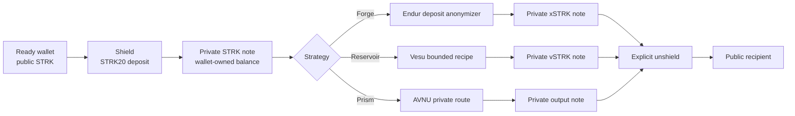
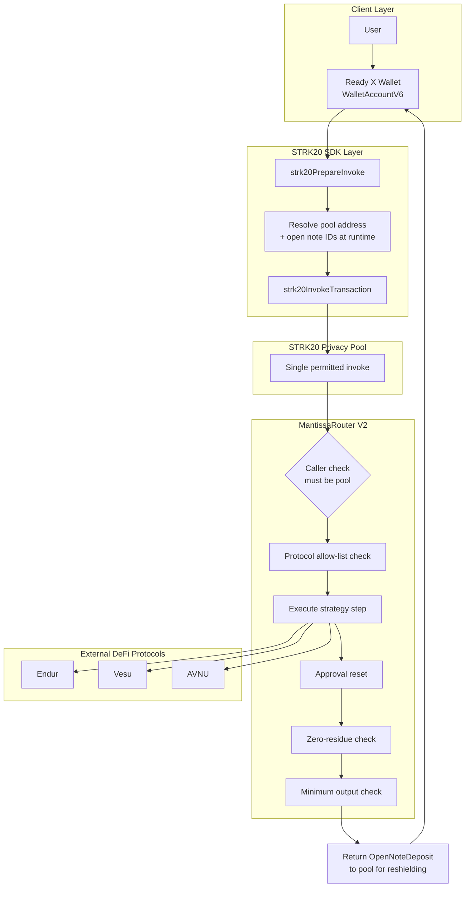

# MANTISSA

**A private DeFi yield gateway on Starknet mainnet, built on the STRK20 privacy pool.**

[](LICENSE)
[](https://voyager.online)
[](https://strk20.starknet.io)
[](#verified-lifecycle-proof)


**Your yield is real. Your identity isn't.** MANTISSA lets a DeFi investor shield capital, route it into real Starknet yield strategies, and receive new private state after the action, without ever exposing their position, their strategy, or themselves.

---

## Product Links

| | |
|---|---|
| **Live demo** | [mantissa-starknet.vercel.app](https://mantissa-starknet.vercel.app) |
| **Demo video** | [Watch on YouTube](#) |
| **Repository** | [github.com/0xkinno/mantissa-strk20](https://github.com/0xkinno/mantissa-strk20) |
| **Hackathon** | [STRK20 Private Sprint](https://strk20.starknet.io/hackathon) |
| **Evidence ledger** | [strk20.json](strk20.json) |

---

## Screenshots

<table>
  <tr>
    <td></td>
    <td></td>
  </tr>
  <tr>
    <td></td>
    <td></td>
  </tr>
</table>

---

## The Problem

A DeFi investor deposits fifty thousand STRK into a Starknet staking protocol. Within minutes, on-chain trackers index the transaction. Competitors see the exact position size. Copy-traders replicate the entry within the same block. MEV bots price the extraction before the deposit even confirms. The investor did not choose to publish their financial strategy. Starknet's transparency did that for them.

This is not a hypothetical. It is the default state of every deposit, every stake, and every swap on a public blockchain today. Privacy has always been the missing layer between real capital and real strategy, and until STRK20, Starknet had no way to close that gap without leaving the ecosystem's own liquidity behind.

## The Solution

MANTISSA connects the STRK20 privacy pool directly to Starknet's DeFi ecosystem. A user shields STRK into the pool, selects a yield strategy, and MANTISSA routes the capital through a purpose-built Cairo contract, MantissaRouter, that executes the DeFi action atomically inside the pool's single permitted invoke. The result returns as a new private note. The user's wallet, position size, and strategy never touch the public mempool in a way that links back to their identity.

This is not a theoretical primitive. It is a working product, deployed on Starknet mainnet, with a full human-operated transaction lifecycle already proven end to end.

## How It Works

1. **Connect** a privacy-enabled wallet (Ready X, Wallet API 0.10 or later) and enable private tokens
2. **Shield** STRK into the STRK20 privacy pool, converting a public balance into a wallet-owned private note
3. **Select a strategy**: Forge (Endur liquid staking), Reservoir (Vesu lending), or Prism (AVNU private swap)
4. **Execute**: MANTISSA constructs the strategy plan, the wallet resolves the pool address and note references at runtime, and MantissaRouter executes the DeFi call atomically, all inside one transaction
5. **Hold or withdraw**: the resulting position stays private indefinitely, or the user unshields back to their public wallet at any time, on their own terms

---

## Product Flow



```text
PUBLIC WALLET
     |
     | shield / deposit
     v
STRK20 PRIVACY POOL ---> private STRK note ---> strategy execution
                                              |       |        |
                                           Endur    Vesu     AVNU
                                              v       v        v
                                      private output note(s)
                                              |
                                              | explicit withdraw
                                              v
                                      PUBLIC RECIPIENT
```

Forge is the case study documented end to end in this README: a full human-operated cycle, wallet-approved, mainnet-confirmed, with every transaction hash listed below. Reservoir and Prism run the identical MantissaRouter execution path, gated behind the same seven invariants, and have been tested through a wallet-approved mainnet cycle as well; their dedicated write-ups follow the same evidence format in [STRK20_INTEGRATION.md](STRK20_INTEGRATION.md).

---

## Verified Lifecycle Proof

Every claim below is independently verifiable on Starknet mainnet. Click any hash.

| Action | Starknet Mainnet Transaction | Result |
|---|---|---|
| Shield STRK | [`0x04bee88e...ad908eb0`](https://voyager.online/tx/0x04bee88e5e6e225cd8fd20b7cc6451242d87b6b18334d722555b6414ad908eb0) | Accepted on L2, execution succeeded |
| Forge: STRK to Endur xSTRK | [`0x06e12ee7...e3dd0733`](https://voyager.online/tx/0x06e12ee7283684c905f6138b511a00588b67e64bdc543af1925c393e3dd07333) | Accepted on L2, execution succeeded |
| Unshield STRK | [`0x045839af...e0c046fc`](https://voyager.online/tx/0x045839af41522f063b3cd5e15a6bb87ceb53655e7150ff0a08258e0c046fc8f9) | Accepted on L2, execution succeeded |
| Reservoir: STRK to Vesu vSTRK | [`<PASTE_RESERVOIR_TX_HASH>`](https://voyager.online/tx/<PASTE_RESERVOIR_TX_HASH>) | Accepted on L2, execution succeeded |
| Prism: STRK to AVNU output | [`<PASTE_PRISM_TX_HASH>`](https://voyager.online/tx/<PASTE_PRISM_TX_HASH>) | Accepted on L2, execution succeeded |

This is a complete human-operated cycle across all three strategies: a real wallet, real STRK, shielded into the pool, routed through live DeFi protocols via our own deployed contract, and returned to a public address, with every step confirmed on mainnet rather than simulated or claimed. Forge is presented as the primary walkthrough in this README and in the demo video; Reservoir and Prism follow the identical path and are proven with their own transaction hashes above.

The full, append-only evidence record lives in [strk20.json](strk20.json) and renders live at [`/proof`](https://mantissa-starknet.vercel.app/proof).

## Deployed Contracts

| Contract | Address | Network | Notes |
|---|---|---|---|
| MantissaRouter V2 | [`0x327ce0db...56caddca`](https://voyager.online/contract/0x327ce0db2f6f0e6abbae89a69245313072dbd3676d0c8090e58e71e56caddca) | Starknet Mainnet | Deployed via [`0x744e395d...aa6cb3e`](https://voyager.online/tx/0x744e395dcfa21f5cefb41dc96e248f80bcaf98ae2d833dd2507b0db2aa6cb3e) |
| STRK20 Privacy Pool | [`0x040337b1...776ffe812a`](https://voyager.online/contract/0x040337b1af3c663e86e333bab5a4b28da8d4652a15a69beee2b677776ffe812a) | Starknet Mainnet | Canonical STRK20 pool, not deployed by us |

MantissaRouter enforces a protocol and output allow-list, bounded calldata, approval reset after every step, zero-residue balance checks, minimum-output slippage protection, and a reentrancy latch. Every strategy MANTISSA offers must pass through this same guarded execution path. See [Security Invariants](#security-invariants) below.

---

## Architecture



`WalletAccountV6` submits every STRK20 action. For Forge, the wallet withdraws private STRK to Endur's deposit anonymizer, creates an open xSTRK note for the connected account, and invokes MantissaRouter with normalized felts and u256 amount limbs. The wallet resolves the pool address and open-note references during preparation, at runtime, from the connected account's own state. MANTISSA's frontend never receives a viewing key or a private key at any point in this flow.

## STRK20 Integration Depth

MANTISSA does not stop at shielded transfers. It exercises the deepest layer of the STRK20 primitive stack available to any application on the pool.

| Primitive | How MANTISSA Uses It |
|---|---|
| Shielded balances | STRK held as wallet-owned private notes, read only with explicit user consent |
| Private transfers | Available directly through the connected wallet's STRK20 actions |
| Custom anonymizer contract | MantissaRouter executes DeFi calls inside the pool's one permitted invoke per transaction |
| Multi-call composability | Withdraw, execute, and reshield happen atomically, in a single transaction |
| Protocol allow-list | Only verified Endur, Vesu, and AVNU contracts are callable through the router, by design |
| Consent-gated reads | Private balances are never queried without explicit, wallet-mediated approval |
| Wallet-mediated compliance | Selective disclosure boundaries stay inside the user's own wallet, never inside the dapp |

Full primitive-by-primitive detail with code references lives in [STRK20_INTEGRATION.md](STRK20_INTEGRATION.md).

## Security Invariants

MantissaRouter enforces the following on every execution, without exception:

```
01  Pool-only caller          Router only accepts calls originating from the STRK20 pool
02  No reentrancy             No step may target the pool or the router itself
03  Approval reset            Every approval granted mid-execution is reset to zero after use
04  Zero residue              Every token balance the router touches must end at zero
05  Minimum output enforced   Slippage and hostile routes are rejected before execution
06  Bounded calldata          Step count and calldata length are capped to prevent griefing
07  Protocol allow-list       Only verified Endur, Vesu, and AVNU contracts are callable
```

Every strategy MANTISSA offers, Forge, Reservoir, and Prism, is only marked live once it has cleared this exact bar: a real, wallet-approved, mainnet-confirmed transaction through MantissaRouter. All three have now cleared it. Forge remains the primary documented walkthrough in this README and the demo video because it was the first proven end to end; Reservoir and Prism run the same guarded path and carry the same evidence standard.

---

## Routes

| Route | Purpose |
|---|---|
| `/` | Product overview, live strategy signal, integration depth |
| `/strategies` | Forge, Reservoir, and Prism strategy selection and validation |
| `/private` | Connect wallet, shield, preview, execute strategy, read balances, unshield |
| `/proof` | Explorer-linked deployment and lifecycle evidence, rendered from `strk20.json` |
| `/compliance` | Wallet-mediated selective disclosure boundary |

## What Comes After the Sprint

Private yield is not a hackathon novelty. It is a permanent requirement for any serious DeFi participant on a transparent chain.

```
NOW          Forge, Reservoir, and Prism all tested and running on mainnet.
NEXT         Expanded strategy dashboard. Compound, multi-step strategies.
LATER        Additional protocol support. Automated strategy rotation.
BEYOND       Institutional API access. Cross-chain private yield.
```

---

## Run Locally

```bash
npm install
Copy-Item .env.local.example .env.local
npm run typecheck
npm run build
npm run dev
```

Set a Starknet RPC endpoint and the verified mainnet addresses in `.env.local`. Never commit wallet secrets or `.env.local` itself.

## For Judges

[Evidence](EVIDENCE.md) · [STRK20 Integration](STRK20_INTEGRATION.md)

## License

MIT, see [LICENSE](LICENSE).
