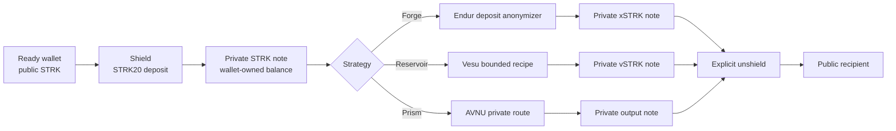

# MANTISSA

**A private DeFi yield gateway on Starknet mainnet, built on the STRK20 privacy pool.**

[](LICENSE)
[](https://voyager.online)
[](https://strk20.starknet.io)
[](#verified-lifecycle-proof)


**Your yield is real. Your identity isn't.** MANTISSA lets a DeFi investor shield capital, route it into real Starknet yield strategies, and receive new private state after the action, without ever exposing their position, their strategy, or themselves.

---

## Status at a Glance

| | |
|---|---|
| **Network** | Starknet mainnet, live |
| **Receipt-confirmed strategies** | Forge (Endur xSTRK, via the Endur deposit anonymizer) · Reservoir (Vesu vSTRK, via MantissaRouter V3) · Prism (AVNU ETH, via MantissaRouter V2) — all re-derived from mainnet receipts |
| **Lifecycle transactions** | 5 of 5 re-derived from receipts (`shield → Forge → unshield`, Reservoir, Prism) |
| **Router invariants** | 7 enforced on every execution, one focused Cairo test each |
| **Cairo tests** | 9 passed, 0 failed — incl. a 400-case adversarial campaign (0 accepted) |
| **TypeScript tests** | 25 passed, 0 failed — recipe guards (AVNU beneficiary pin, 99% floor, bounds), pool-event decoding against real receipts, evidence-snapshot checks |
| **Per-action disclosure** | Shipped in `/private`: pool Deposit/Withdrawal traffic in your rough size band is measured live before you sign |
| **CI** | GitHub Actions runs typecheck, TypeScript tests, the production build, and the Cairo suite; mainnet receipt re-derivation runs when an RPC secret is configured |
| **Protocol allow-list** | Endur · Vesu · AVNU (plus the Ekubo router used by recipe builds), not arbitrary protocols |
| **Evidence ledger** | [evidence/claims.json](evidence/claims.json) · [strk20.json](strk20.json) · [DISCOVERY.md](DISCOVERY.md) |

---

## Product Links

| | |
|---|---|
| **Live demo** | [mantissa-starknet.vercel.app](https://mantissa-starknet.vercel.app) |
| **Demo video** | [Watch on YouTube](https://youtu.be/qqnkz5y3SLw?si=cpEaV8I1CmE4xeP_) |
| **Blog Post** | [Read on Medium](https://medium.com/@ojilerekingsley/the-real-value-hidden-in-plain-sight-building-mantissa-on-strk20-8bbaa9ddac67) |
| **X Post** | [Read on X](https://x.com/0xkiddok) |
| **Repository** | [github.com/0xkinno/mantissa-strk20](https://github.com/0xkinno/mantissa-strk20) |
| **Hackathon** | [STRK20 Private Sprint](https://strk20.starknet.io/hackathon) |
| **Evidence ledger** | [strk20.json](strk20.json) |

---

## Screenshots

<table>
  <tr>
    <td></td>
    <td></td>
  </tr>
  <tr>
    <td></td>
    <td></td>
  </tr>
</table>

---

## The Problem

DeFi protocols on Starknet quietly assume whoever calls them is a privileged, persistent account — one that holds keys, holds a balance, and wants the proceeds of its own call. A private router is none of those things. When a strategy encodes one of those assumptions, the call fails with a revert that names the protocol’s internal check — `'Beneficiary is not the caller'`, `'not-allowed'` — never the actual mismatch.

An investor who deposits fifty thousand STRK into a public staking protocol has the position size, entry timing, and strategy indexed within minutes — copy-traded in the same block, priced by MEV before the deposit even confirms. Privacy has always been the missing layer between real capital and real strategy, and until STRK20, closing that gap meant leaving Starknet’s own liquidity behind.

## The Solution

MANTISSA is a private DeFi yield router that pre-flights every strategy against that exact assumption before a user ever signs. A user shields STRK into the STRK20 pool, selects Forge, Reservoir, or Prism, and MANTISSA routes the capital through a guarded execution path — MantissaRouter, a purpose-built Cairo contract, for Prism and Reservoir, and the Endur deposit anonymizer for Forge — that executes the DeFi action atomically inside the pool’s single permitted invoke and returns the result as a new private note.

## The Proof

Two independent protocols failed this exact way on live mainnet state, and both are now receipt-confirmed side by side with their fixes:

- **AVNU — Prism.** `multi_route_swap` defaults `beneficiary` to its own executor and enforces `beneficiary == caller`. Executed from a router, the unpatched build reverts `'Beneficiary is not the caller'`; with the beneficiary pinned to the router, the identical call settles clean and is receipt-confirmed on mainnet (block 14012996). Filed upstream as [avnu-sdk#337](https://github.com/avnu-labs/avnu-sdk/issues/337).
- **Vesu — Reservoir.** The legacy V2.1 vSTRK v-token restricts `deposit()` to its own pool extension and reverts `'not-allowed'` for an external router. Targeting the unrestricted V2 vSTRK v-token instead settles clean and is receipt-confirmed on mainnet (block 14038277).

Both comparisons are reproduced in `evidence/prove-caller-identity-tax-{avnu,vesu}.json`, with the full reasoning in [DISCOVERY.md](DISCOVERY.md).

## The Mechanism

The router never trusts a protocol’s documented interface. Every strategy step is simulated against live mainnet state, with the router as the caller, before it is reported clean — and the check is public, so any team on the pool can run it against their own router and target with `scripts/check-caller-identity.mjs`. On top of that, seven invariants are enforced in the router’s Cairo source and covered one-to-one by the test suite below: pool-only caller, no reentrancy, approval reset, zero residue, minimum output, bounded calldata, and the protocol allow-list.

## How It Works

1. **Connect** a privacy-enabled wallet (Ready X, Wallet API 0.10 or later) and enable private tokens
2. **Shield** STRK into the STRK20 privacy pool, converting a public balance into a wallet-owned private note
3. **Select a strategy**: Forge (Endur liquid staking), Reservoir (Vesu lending), or Prism (AVNU private swap)
4. **Execute**: MANTISSA constructs the strategy plan, the wallet resolves the pool address and note references at runtime, and MantissaRouter executes the DeFi call atomically, all inside one transaction
5. **Hold or withdraw**: the resulting position stays private indefinitely, or the user unshields back to their public wallet at any time, on their own terms

---

## Product Flow



## What This Actually Proves

MANTISSA's evidence is not a link to an explorer. Every published hash is re-read from the Starknet RPC, and each checklist item is reconstructed from the events the STRK20 pool, the token contracts, and the invoked contract actually emitted — not from a tx status or an explorer page. `scripts/verify-mainnet.mjs` performs that re-derivation, and the pool's own event definitions (in the pinned `starknet-privacy` source) decide what can and cannot be observed. The regenerated output for all five lifecycle hashes is kept in full in [EVIDENCE.md](EVIDENCE.md), snapshotted at [evidence/mainnet-verify-5-of-5.txt](evidence/mainnet-verify-5-of-5.txt), and audited claim-by-claim in [evidence/claims.json](evidence/claims.json).

The five lifecycle slots all re-derive clean: shield and unshield are pool-touch-only transactions (their five strategy checks print `n/a` because no strategy step ran), while Forge, Reservoir, and Prism each clear all six checks.

**Becomes public.** That a shield, an unshield, or a strategy execution occurred. The protocol that was touched (Endur for the receipt-proven Forge path; AVNU for the receipt-proven Prism path; Vesu for the receipt-proven Reservoir path). The router or anonymizer address that executed the step. The timing of each transaction: block number and finality. The amount withdrawn from the pool to the executing contract, the output note id, and its token.

**Stays private.** The total shielded balance, which the pool's ledger encrypts and only a wallet holding the viewing key can read. Which specific notes were spent: the pool publishes one-way nullifiers, and only the note owner can recognise a nullifier as theirs. The user's Starknet address as it relates to their private position: note ownership and withdrawal identity are encrypted in the pool's events, so observers cannot link a note to an address. Unrelated shielded activity, which produces no linkable identifier.

**Reduces privacy anyway.** Deposits into and withdrawals out of the pool are public by protocol design; only movement inside the pool is shielded. A shield transaction publishes the depositor's address and amount. Timing correlation between a shield and a strategy execution can narrow the anonymity set if done back-to-back, so the documented flow shields ahead of time. The executing contract's address and the withdrawn amount are public on every strategy step.

**What MANTISSA does not prove.** MantissaRouter cannot itself distinguish shielded-origin funds from a publicly-funded transfer to the router: capital that reaches the router by an ordinary public ERC-20 transfer is treated identically to capital the pool withdrew from private notes. On the receipt-proven mainnet Forge transaction the pool invoked the Endur deposit anonymizer rather than MantissaRouter V2, so that receipt proves the STRK20-pool-to-Endur path but does not by itself prove the router's guards executed on-chain; they are enforced in its Cairo source and covered one-to-one by the tests below. The receipt-proven Prism transaction did execute through MantissaRouter V2 — STRK in, ETH out, approvals reset to zero, zero residue — and the Reservoir transaction executed the same guarded path through MantissaRouter V3 — STRK in, Vesu V2 vSTRK out, approvals reset to zero, zero residue — so the router's on-chain execution is proven for both paths. And because the pool's `ExternalContractInvoked` event carries no calldata, no verifier can prove the exact parameters of a strategy step, only the invoked contract, its entry point, and the events that resulted.

**Measured, not asserted.** The `/private` page applies the same boundary per action: before a shield, strategy, or unshield is signed, it reads the pool's own Deposit and Withdrawal events for the token over a recent window and counts how many fall in the same rough size band, stating plainly when the band is thin or empty. See [DISCOVERY.md](DISCOVERY.md) "live per-action disclosure".

## Verified Lifecycle Proof

Every claim below is independently verifiable on Starknet mainnet — click any hash, or reproduce the re-derivation yourself with `node scripts/verify-mainnet.mjs --all`. The complete, copy-pasteable output is kept in [EVIDENCE.md](EVIDENCE.md) and snapshotted at [evidence/mainnet-verify-5-of-5.txt](evidence/mainnet-verify-5-of-5.txt).

| Action | Starknet Mainnet Transaction | Block | Result |
|---|---|---|---|
| Shield STRK | [`0x04bee88e...ad908eb0`](https://voyager.online/tx/0x04bee88e5e6e225cd8fd20b7cc6451242d87b6b18334d722555b6414ad908eb0) | 13904581 | ACCEPTED_ON_L1 · SUCCEEDED |
| Forge: STRK → Endur xSTRK | [`0x06e12ee7...e3dd0733`](https://voyager.online/tx/0x06e12ee7283684c905f6138b511a00588b67e64bdc543af1925c393e3dd07333) | 13904839 | ACCEPTED_ON_L1 · SUCCEEDED |
| Unshield STRK | [`0x045839af...e0c046fc`](https://voyager.online/tx/0x045839af41522f063b3cd5e15a6bb87ceb53655e7150ff0a08258e0c046fc8f9) | 13906250 | ACCEPTED_ON_L1 · SUCCEEDED |
| Prism: STRK → AVNU output (ETH), via MantissaRouter V2 | [`0x78815ce9...e0aa6b3`](https://voyager.online/tx/0x78815ce99e5279f44f2544669b5f4ad7a333b7535f22103b137a1a85e0aa6b3) | 14012996 | ACCEPTED_ON_L1 · SUCCEEDED |
| Reservoir: STRK → Vesu vSTRK, via MantissaRouter V3 | [`0x06f749fa...c85acc8`](https://voyager.online/tx/0x06f749fafee519140c48f57d1882b04f3107fb453728d84d57bc0aa63c85acc8) | 14038277 | ACCEPTED_ON_L1 · SUCCEEDED |

The full, append-only evidence record lives in [strk20.json](strk20.json), renders live at [`/proof`](https://mantissa-starknet.vercel.app/proof), and is audited claim-by-claim in [evidence/claims.json](evidence/claims.json).

## Router Pre-Flight

`scripts/simulate-router.mjs` builds each router plan exactly as MantissaRouter would execute it and simulates it against live mainnet RPC state — no gas is spent, and no line is trusted from an explorer or a tx status. This pre-flight record ran before the mainnet receipts below; every route it cleared is now also receipt-confirmed in the [Verified Lifecycle Proof](#verified-lifecycle-proof) table. The output is copy-pasteable into a verification log:

```text
pre-flight simulator · MantissaRouter 0x74fc61266f · pool 0x40337b1af3 · Alchemy mainnet
simulating router plan(s) with 10 STRK funding (no gas spent)

NOTE funder 0x35011ee989 holds 5.062239363122783 STRK < requested 10; clamping simulation to 5.062239363122783 STRK

forge → Endur xSTRK
  ok   Protocol allow-list check passed (Endur xSTRK 0x28d709c875 matched deployed router allow-list)
  ok   Output token allow-listed (xSTRK 0x28d709c875)
  ok   Strategy step simulated clean on mainnet state (Endur accepted the router's approve + deposit; 8 events)
  ok   Router caller guard live on mainnet (I1 — non-pool caller rejected with MANTISSA_CALLER)

reservoir -> Vesu vSTRK (V2 v-token ERC-4626 deposit)
  ok   Protocol allow-list check passed (Vesu V2 vSTRK v-token 0x6d6d2bf905 matched deployed router allow-list)
  ok   Output token allow-listed (Vesu vSTRK (V2 v-token) 0x6d6d2bf905)
  ok   Strategy step simulated clean on mainnet state (9 events)
  ok   Output vSTRK minted to MantissaRouter (Transfer 0x0 -> 0x74fc61266f, 4.965671422770671 vSTRK for 5.062239363122783 STRK)
  ok   Router caller guard live on mainnet (I1 - non-pool caller rejected with MANTISSA_CALLER)

prism → AVNU ETH
  ok   Protocol allow-list check passed (AVNU router 0x4270219d36 matched deployed router allow-list)
  ok   Output token allow-listed (ETH 0x49d36570d4)
  ok   AVNU build defaults beneficiary to the executor (0x426dcd1ab5); recipe pins it to MantissaRouter
  ok   Beneficiary invariant satisfied (multi_route_swap calldata[8] pinned to MantissaRouter 0x74fc61266f; AVNU requires beneficiary == caller and the router is the caller)
  ok   AVNU quote/route settles clean on mainnet state when beneficiary == caller (verified by patched simulation; 32 events)
  ok   Unpatched AVNU build verified to fail AVNU's own beneficiary==caller check (build defaults to the executor; pin is required)
  ok   Router caller guard live on mainnet (I1 — non-pool caller rejected with MANTISSA_CALLER)

3/3 router plan(s) fully pre-flight clean (see lines above)
```

```json
{
  "campaign": "invariant_adversarial_campaign_rejects_hostile_plans",
  "total_cases": 400,
  "accepted": 0,
  "false_clearances": 0,
  "sweeps": [
    { "case": "non_allowlisted_target", "cases": 100, "rejected_with": "MANTISSA_NOT_ALLOWED", "false_clearances": 0 },
    { "case": "oversized_calldata", "cases": 100, "rejected_with": "MANTISSA_CALLDATA", "false_clearances": 0 },
    { "case": "oversized_step_count", "cases": 100, "rejected_with": "MANTISSA_STEPS", "false_clearances": 0 },
    { "case": "below_floor_output", "cases": 100, "rejected_with": "MANTISSA_MIN_OUTPUT", "false_clearances": 0 }
  ],
  "snforge": { "tests": 9, "passed": 9, "failed": 0 }
}
```

## Limitations

Plain scope, stated without overclaiming.

- **Test scope.** The automated suite is 9 Cairo tests (one per invariant, plan serialization, and the 400-case adversarial campaign) plus 25 TypeScript regression tests (recipe guards, pool-event decoding against real mainnet fixtures, evidence-snapshot checks). It exercises the router's guard logic and client-side encoding in isolation and does not test third-party protocol contracts or the wallet UI. CI runs both suites on every push.
- **Wallet API constraint.** STRK20 strategy execution can only be submitted by a Wallet API 0.10+ wallet that resolves the pool address and open-note placeholders at runtime — the dapp cannot forge the `privacy_invoke` itself. Forge, Prism, and Reservoir all cleared this constraint and are receipt-confirmed on mainnet (Prism block 14012996; Reservoir block 14038277).
- **Prism requires a beneficiary pin.** AVNU's `multi_route_swap` enforces
  `beneficiary == caller`, and its private build defaults the beneficiary to AVNU's
  own executor. The recipe pins `calldata[8]` to the executing router (MantissaRouter
  V2 on the receipt-proven Prism transaction). See [D-003](DECISIONS.md).

- **Allow-list scope.** The protocol allow-list covers Endur, Vesu, and AVNU (plus the Ekubo router used by Prism recipes) only, not arbitrary protocols. Because the router is immutable, adding a protocol requires a new deployment.
- **Mainnet evidence depth.** The receipt-proven lifecycle is shield → Forge (Endur xSTRK) → unshield, plus Prism (STRK → AVNU ETH through MantissaRouter V2) and Reservoir (STRK → Vesu vSTRK through MantissaRouter V3). The Forge transaction ran through the Endur deposit anonymizer; Prism was the first receipt-confirmed mainnet execution of MantissaRouter (V2), and Reservoir is the first through MantissaRouter V3.
- **No calldata disclosure.** The pool's `ExternalContractInvoked` event does not include calldata, so receipt re-derivation proves the invoked contract and entry point but not the exact parameters of a strategy step.

- **Reservoir required a Vesu V2 v-token swap.** The original allow-listed v-token (`0x037ae3...`) was a Vesu V2.1 receipt whose `deposit()` accepts only its pool extension as the caller (`'not-allowed'` on live mainnet state). Reservoir now targets the Vesu V2 vSTRK v-token (`0x6d6d2bf9...`, public ERC-4626 `deposit(assets, receiver)`): the exact router step simulates clean on mainnet and mints vSTRK to the router. This required a router redeploy (MantissaRouter V3) with the new v-token allow-listed as both target and output. Receipt-confirmed on mainnet 2026-08-29 (block 14038277, `0x06f749fa...c85acc8`).

See [DECISIONS.md](DECISIONS.md) for the engineering decisions behind the router and [DOCUMENTATION.md](DOCUMENTATION.md) for the full audit trail of recent updates and verifications.

---


## What This Costs

STRK20 charges a flat **6 STRK per privacy operation** — measured live from the
pool's own fee view (`get_fee_amount`, see [evidence/pool-fee.json](evidence/pool-fee.json))
and enforced in the app before a shield is offered. The fee is paid by the wallet,
separate from principal, and is the same whether 2 STRK or 50,000 STRK moves.

| Operation | Pool fee (current schedule) | Amount moved (receipt-confirmed lifecycle) |
|---|---|---|
| Shield STRK | 6 STRK | 7 STRK deposited \* |
| Forge — STRK → Endur xSTRK | 6 STRK | 7 STRK in → 5.9532 xSTRK out |
| Unshield STRK | 6 STRK | wallet-owned note withdrawn \* |
| Reservoir — STRK → Vesu vSTRK | 6 STRK | 2 STRK in → 1.9619 vSTRK out |
| Prism — STRK → AVNU ETH | 6 STRK | 2 STRK in → 0.0000209 ETH out |

A full `shield → execute → unshield` lifecycle is three pool operations, so at the
current schedule it costs **18 STRK in pool fees** before any strategy result. That is
the real economics of the pool: below a certain position size, private yield loses to
the fee floor, and MANTISSA says so instead of pretending otherwise.

\* Shield and unshield amounts are from the operator-run lifecycle; Forge, Reservoir,
and Prism amounts are printed by the receipt re-derivation itself. All five
lifecycle transactions are receipt-confirmed. See
[evidence/mainnet-verify-5-of-5.txt](evidence/mainnet-verify-5-of-5.txt).

## Upstream Contributions

| Repo | Issue | What was reported | Status |
| --- | --- | --- | --- |
| [avnu-labs/avnu-sdk](https://github.com/avnu-labs/avnu-sdk) | [#337](https://github.com/avnu-labs/avnu-sdk/issues/337) | `multi_route_swap` beneficiary is pinned to the build taker and the on-chain `beneficiary == caller` constraint is undocumented, which reverts `'Beneficiary is not the caller'` for integrations that execute the built calldata from their own contract. Filed from the Prism debug session. | Open |

## For Other Builders

The verification tooling in this repository is public infrastructure, not a
MANTISSA-internal detail:

- **`scripts/check-caller-identity.mjs`** — a CLI preflight that takes any target
  contract and a calldata sample, simulates the step against live mainnet state with
  your router as the caller, and prints the same `ok` / `FAIL` checklist used here.
  It catches caller-identity assumptions (privileged callers, beneficiary defaults)
  before a user signs anything. See
  [STRK20_INTEGRATION.md § Caller-identity preflight](STRK20_INTEGRATION.md).
- **`scripts/verify-mainnet.mjs --all`** — re-derives every receipt checklist item
  from RPC events, not from tx status or an explorer.
- **`scripts/audit-caller-identity.mjs`** — the systematic sweep used to verify each
  integration (and the Ekubo contracts) before a strategy is wired in.

## Routes

| Route | Purpose |
|---|---|
| `/` | Product overview, live strategy signal, integration depth |
| `/yield` | Forge, Reservoir, and Prism strategy selection and validation |
| `/private` | Connect wallet, shield, preview, execute strategy, read balances, unshield |
| `/proof` | Explorer-linked deployment and lifecycle evidence, rendered from `strk20.json` |
| `/compliance` | Wallet-mediated selective disclosure boundary |

## What Comes After the Sprint

Private yield is not a hackathon novelty. It is a permanent requirement for any serious DeFi participant on a transparent chain.

```
NOW          Shield → Forge → unshield + Prism (AVNU ETH via MantissaRouter V2) + Reservoir (Vesu vSTRK via MantissaRouter V3) all receipt-proven on mainnet.
NEXT         Expanded strategy dashboard. Compound, multi-step strategies.
LATER        Additional protocol support. Automated strategy rotation.
BEYOND       Institutional API access. Cross-chain private yield.
```

---

## Run Locally

```bash
npm install
Copy-Item .env.local.example .env.local
npm run typecheck
npm test
npm run build
node scripts/verify-all.mjs   # one-command full verification (typecheck, build, snforge, verify-mainnet, simulate-router)
npm run dev
```

Set a Starknet RPC endpoint and the verified mainnet addresses in `.env.local`. Never commit wallet secrets or `.env.local` itself.

## For Judges

[Evidence](EVIDENCE.md) · [Decisions](DECISIONS.md) · [Discovery](DISCOVERY.md) · [Documentation](DOCUMENTATION.md) · [STRK20 Integration](STRK20_INTEGRATION.md) · [Claims ledger](evidence/claims.json) · [strk20.json](strk20.json)

## License

MIT, see [LICENSE](LICENSE).
